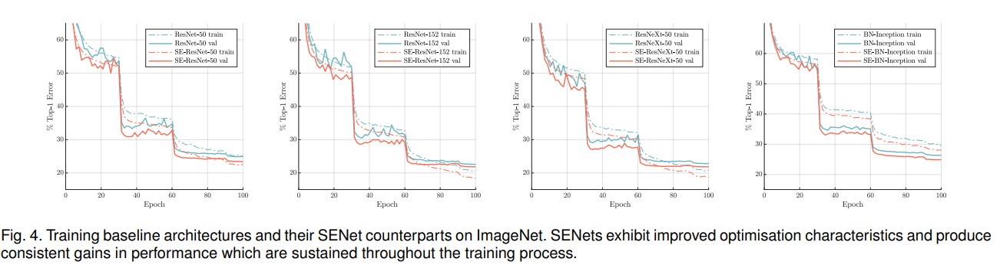
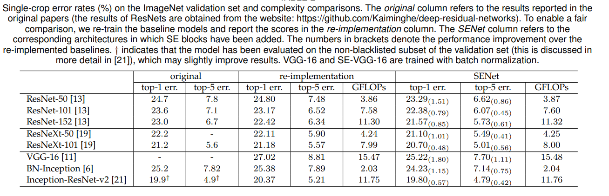
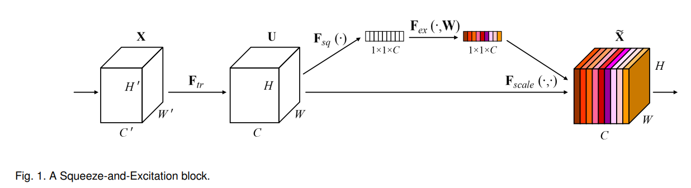
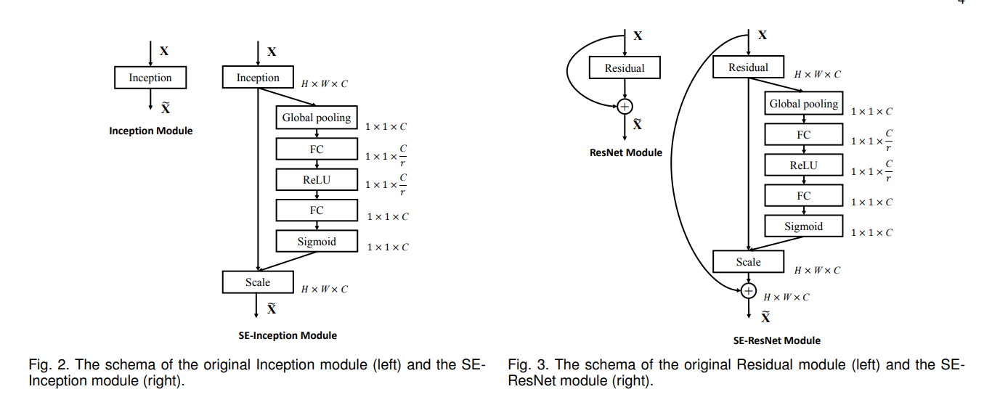
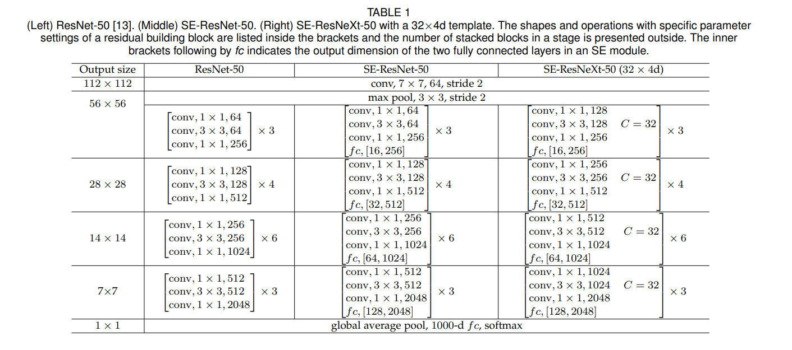
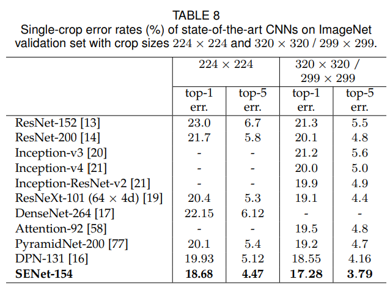
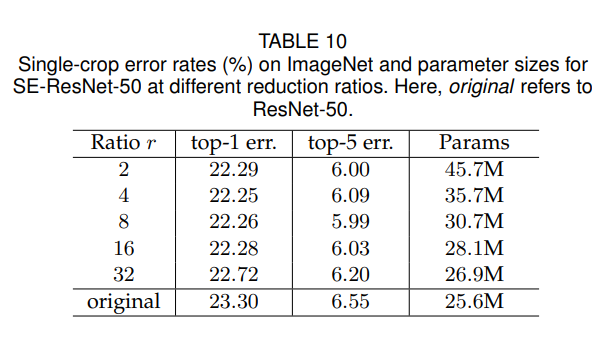
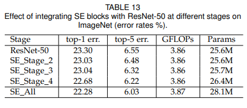
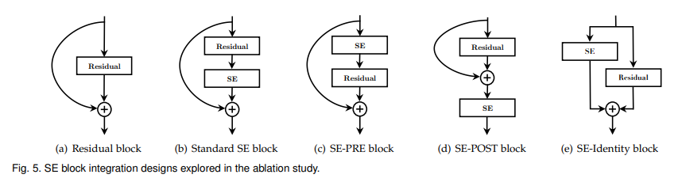
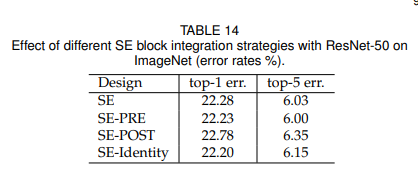

# SENet
## ポイント
- SENetとは、SEブロックを組み込んだネットワークアーキテクチャの総称
- SEブロックとは、特徴量マップのチャネル間の相互依存性を明示的にモデル化するための構造
- 特徴量マップに、重要度に応じ**アテンション**をかける働きをする
- 既存のアーキテクチャにSEブロックを組み込むことで学習効率、精度が向上する 
</img>
- 上記図はSEブロックを組み込んだ場合のResNet, ResNeXt, Inceptionの学習効率改善結果を示している。オリジナルのものより学習収束が早くなっている  
</img>
- 上記図はSEブロックを組み込んだ場合の精度改善結果を示している。1%前後、オリジナルのものより精度が良くなっている
## SEブロック
- SEブロックは、チャネル間の相互依存性を明示的にモデル化し、特徴量マップの学習を強化することが狙い 
</img>
- SqueezeとExcitationとの 2つ のステップで次の畳み込みフィルター応答を再調整する
- **Squeezeステップ**：グローバル平均プーリングを使用してチャネル毎の統計を生成
- グローバル平均プーリングを用いる根拠：特徴量マップの空間情報(H×W)をチャネル記述子に圧縮するため。（特徴量マップ1ピクセル毎の受容野情報を集約）
- **Excitationステップ**：2つの全結合層によって、ゲート機構をモデル化。inputはSqueezeステップの圧縮特徴量マップ
- ゲート機構式： $s=Fex(z,W)=σ(g(z,W))=σ(W2δ(W1z))$ 。 $σ$ はsigmoid, $δ$ はReLU, $W1 ∈ R^{C/r \times C}$ および $W2 ∈ R^{C \times C/r}$ を表す
- $r$ は圧縮率という（FC層パラメータを調整するためのハイパーパラメータ）
- 最後にExcitationステップのアウトプットを入力特徴量マップに乗算する。つまり、各チャンネル依存関係を捉えた重みを元の特徴量マップに乗算し、セルフアテンションを行う 
</img>
- 上記は最終的なSEブロックはどのような構成になるか、またInceptionとResidualブロックに追加する方法を表している 
</img>
- 上記はSEブロックを組み込んだResNet, ResNeXtの構造を表している
## トレーニング方法：ImageNet
- 上記の結果を得るために行ったトレーニング方法を下記に示す
- ミニバッチサイズ：1024
- SGDにより最適化。学習率は 0.6 から始まり、30エポック毎に10で除算する。ウェイト減衰 0.0001 とモーメンタム 0.9 を使用
- モデルは100エポックトレーニング 
- データオーギュメンテーション：ランダムスケール拡張（[256, 480]）, ランダムクロップ（ResNet:224, Inception:299）, ピクセル毎に平均値減算（正規化）、Horizontal Flip, Vertical Flip
- 圧縮率 $r$ は、16
## テスト推論
- 上記の結果を得るために行ったテスト評価方法を下記に示す
- 短辺をリサイズ後(ResNet:256, Inception:352)、各画像からセンタークロップ(ResNet:224, Inception:299)されたパッチを評価
## ILSVRC 2017 Classification Competition
- ResNeXtと統合することにより、追加モデル SENet-154 を構築しました (アーキテクチャの詳細は付録に記載される)
- このモデルを、標準のクロップ サイズ (224×224 および 320×320) を使用して、以下にImageNetの検証セットの結果を示す 
</img> 
- SENet-154 では、トップ1エラーが 18.68%、トップ5エラーが 4.47% を達成(224×224)
- また、別の方法を使用し、最高精度を出せるトレーニング方法を模索
- 強化学習を使用してトレーニング中にデータ拡張のための新しいポリシーを開発し、[31] (E.Real, A.Aggarwal, Y.Huang, and Q.V.Le,“Regularized evolution for image classifier architecture search,”)で検索されたアーキテクチャのパフォーマンスを向上させる
- 最高の全体的なパフォーマンスは、ResNeXt-101 32×48d アーキテクチャ。これは、約10億枚の弱くラベル画像でモデルを事前トレーニングし、ImageNet でファインチューニングした
- より洗練されたデータ拡張(“Autoaugment: Learning augmentation policies from data,” )と広範なデータ拡張によってもたらされる改善事前トレーニング(“Exploring the limits ofweakly supervised pretraining,”)は、ネットワーク アーキテクチャはさらに精度を改善する可能性がある
## Ablation Study
- SEブロックの影響をより深く理解するために,ResNetをベースラインとして,アブレーション実験を行った
- ResNetアーキテクチャでは、Excitationステップにおける FC層のバイアスを除去するとチャネル依存関係のモデリングが容易になることが経験的に分かった
- データオーギュメンテーションは、上記で説明されているアプローチ
- パフォーマンスの上限を調査するために、学習率は 0.1 に初期化され、検証損失がフラット(合計で約 300 エポック) までトレーニングが継続される
- Loss減退が頭打ちになったら、学習率に1/10を乗算、このプロセスが繰り返されます (合計 3 回)
- ラベル平滑化を使用し、過学習を防ぐ
#### 圧縮率
- 圧縮率をそれぞれ変更した結果を下記に示す 
</img> 
- 複雑さが増加してもパフォーマンスは単調に向上しませんが、比率が小さいとモデルのパラメーターサイズが劇的に増加する 
- r = 16 に設定すると、精度と複雑さのバランスが取れた結果が得られる
- しかし、**ネットワーク全体で同じ比率を使用することは最適ではない可能性がある (異なるレイヤーによって異なる役割が実行されるため)**
- そのため、**特定のアーキテクチャのニーズを満たすように比率を調整することで、さらなる改善が達成できる可能性がある**
#### 導入するネットワーク箇所
- SEブロックを ResNet-50 に一度に1段階ずつ統合することで、さまざまな段階での SE ブロックの影響を調査する
- ステージ2、ステージ3、ステージ4 に分類し、その結果を下記に示す 
</img>
#### 統合戦略
- SEブロックを既存のアーキテクチャに統合する際の SEブロックの位置の影響を評価する
- 上記のSE設計に加え、右記3つの変形例を検討する。(1)SE-PRE ブロック。SEブロックは残差ユニットの前に移動。(2)SE-POSTブロック。SEブロックはアイデンティティブランチとの合計後(ReLU 後) に移動。(3) SE-Identityブロック。SEブロックは、SEブロックと並行してアイデンティティ接続上に配置される。下記にバリアントを示す
</img>
- また、各バリアントのパフォーマンスを下記に示す 
</img>
- SE-POSTブロックのみパフォーマンスが低下
- この結果は、ブランチ集約の前に適用された場合、かなり堅牢になることが分かる
- また、SEブロックの使用法を特定のアーキテクチャに合わせて調整することで、さらなる効率の向上が達成できると予想できる
## 参考
1. https://qiita.com/cinchan/items/831953e32ce16c39d71b
2. https://arxiv.org/pdf/1709.01507.pdf
